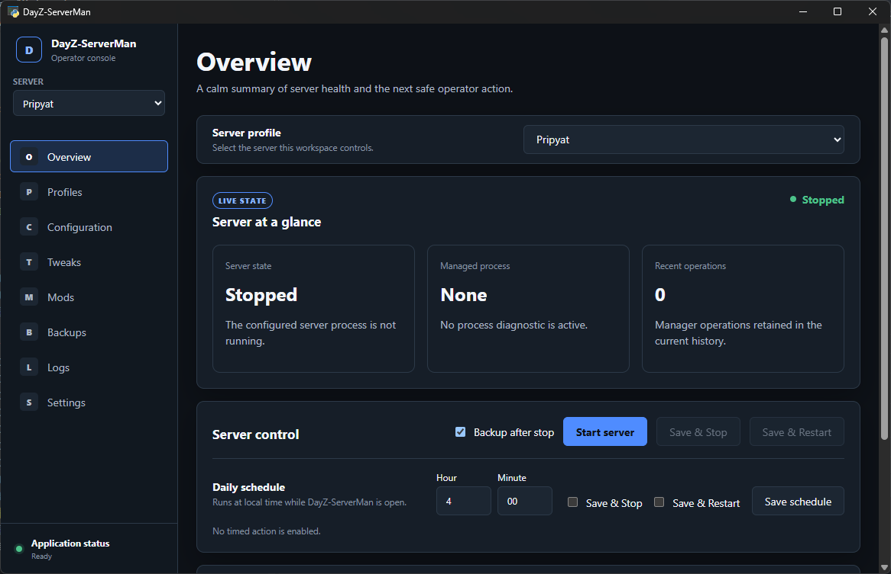

# DayZ-ServerMan

DayZ-ServerMan is a movable Windows desktop manager for local DayZ servers.
It uses Python and the Windows WebView2 runtime. It does not need a build step.

## Use the application

1. Copy the complete [`runnable/`](./runnable/) directory.
2. Run `DayZ-ServerMan.py` inside that directory.
3. Follow the [operator quick start](./runnable/README.md).

The target computer needs Python 3.12 or 3.13. The first launch creates a
project-local `.venv` and installs the packages in `requirements.txt`.

## Repository map

- [`runnable/`](./runnable/) — complete movable application
- [`docs/`](./docs/) — operations and development documentation
- [`tests/`](./tests/) — automated tests

Start from the repository root with:

```text
py runnable\DayZ-ServerMan.py
```

<!-- shot:root-01 -->


See the [documentation index](./docs/README.md) for deeper guidance.

## Backups and recovery

Full backups include the server configuration, runtime directory, complete
mission, world persistence and profile definition. Mod binaries are not included.

- **Latest backups** shows the selected server's three newest backups. Use a
  card's restore icon to review that backup for the existing profile.
- **Restore profile from backup…** opens a ZIP picker to recreate a deleted
  profile. It also works when no profiles exist. Select an archive, review the
  destination and ports, then confirm.

Older archives remain stored. Direct profile reconstruction requires complete
profile metadata; compatible older archives can still restore an existing profile.
Restore does not start the server. Check readiness and start it separately.

See the [operator guide](./runnable/README.md#backups-and-restores) for the steps
and [restore operations](./docs/operations.md#restore-behavior) for conflicts and recovery.

## License

DayZ-ServerMan uses the [MIT License](./LICENSE).

The license covers this project's source code only. DayZ server files, Steam
Workshop mods, and third-party assets keep their own terms.
