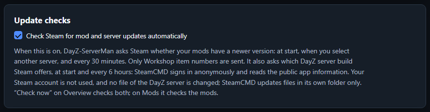
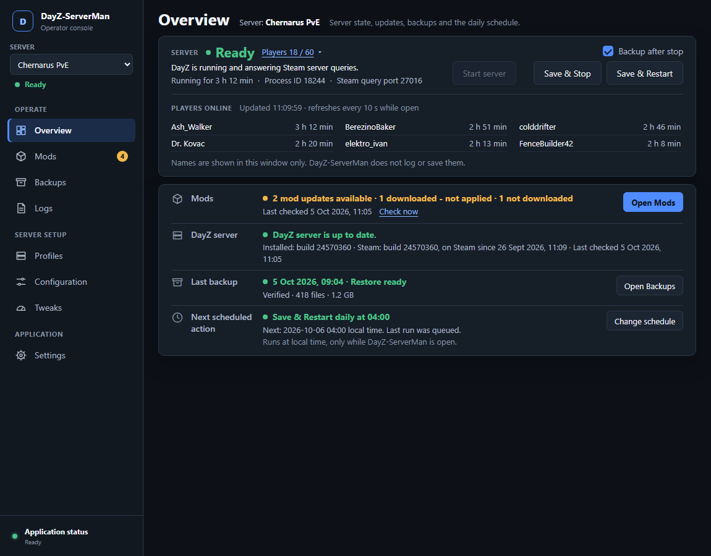
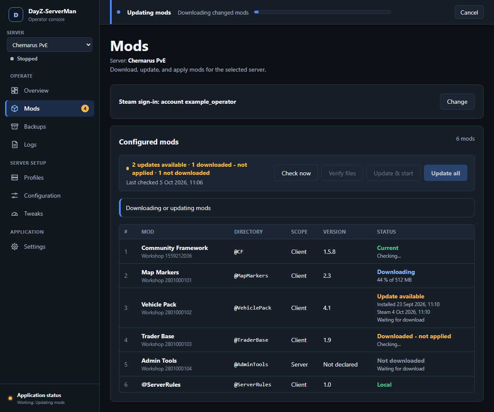

# DayZ-ServerMan operator guide

This directory is the complete movable application. Copy the whole directory.
Do not copy only the starter or `src` directory.

## Requirements

- Windows 11 x64
- Python 3.12 or 3.13 with `venv` and pip
- Microsoft Edge WebView2 Runtime
- Internet access for the first launch and dependency updates

## Start the application

Run:

```text
py DayZ-ServerMan.py
```

The first launch creates `.venv` beside the starter. It then installs the
pinned packages from `requirements.txt` and restarts with the local Python.
Later launches reuse this environment.

Do not copy `.venv` between computers. You can delete it if dependency setup
becomes damaged. The next launch creates it again.

One window can be open for each copy of DayZ-ServerMan. A second window, or a
window while a command changes something, shows a message and closes. To run
commands from a terminal, see [Command line](#command-line).

<!-- shot:readme-01 -->


## First setup

1. Open **Settings**.
2. Select the folder that contains the DayZ server installation.
3. Select the folder that contains `steamcmd.exe` and its Steam library.
4. Keep the portable backup destination or select a custom folder.
5. Select **Save locations** and review the status of each folder.
6. Create, import, or restore a server profile.

<!-- shot:readme-02 -->


The manager derives these paths from the selected folders:

- `DayZServer_x64.exe`
- `steamcmd.exe`
- `steamapps/workshop/content/221100`

The DayZ server, SteamCMD, backup folder, and manager can be in unrelated
locations. While the form holds an unsaved change, the saved folder that is
still in use shows **In use until saved**. The saved backup destination
carries the **In use** mark.

### Update checks

**Settings → Update checks** has one switch: **Check Steam for mod and server
updates automatically**. It is on by default and saves at once.

<!-- shot:readme-11 -->


While the switch is on, DayZ-ServerMan makes two checks:

- **Mods.** It asks the Steam Web API whether your Workshop mods have a newer
  version. Only the Workshop item numbers are sent. No Steam key or sign-in is
  used. Steam also receives the IP address of this computer, as with any
  internet request.

  This check runs at start, on **Mods** open, when you select another server,
  after a task on **Mods**, and when you turn the switch on.
  It is skipped when the last check is less than 5 minutes old, unless a mod
  has no answer yet. It also happens 30 minutes after the last check.
- **DayZ server build.** SteamCMD signs in anonymously and reads the public
  app information of the DayZ server (app 223350). This happens at start,
  unless a check ran in the last 10 minutes, and then every 6 hours. Your
  Steam account is not used. No file of the DayZ server changes. SteamCMD
  updates files in its own folder only.

Neither check downloads or applies anything. If you turn the switch off, no
automatic check runs. **Check now** still checks. **Update all**, **Update &
start**, and **Update & restart** still ask Steam first and send the same
Workshop item numbers.

## Create a server profile

Open **Profiles** and select **New profile**. Enter a display name, game port,
and mission. The profile ID is generated from the display name and can be
changed before creation.

The mission list comes from the configured DayZ installation's `mpmissions`
directory. Select **Custom mission…** to enter an installed custom mission such
as `mpmissions\MyMission.chernarusplus`. The directory must already exist
inside the configured DayZ installation. Profile creation does not download
mission files or install required mods.

DayZ-ServerMan creates these operational files inside the DayZ installation:

```text
serverman\<profile-id>\serverDZ.cfg
serverman\<profile-id>\profile\
```

Application source, Python packages, settings, and backups are not placed in
that directory. The generated configuration uses safe initial values and can
be adjusted from **Configuration** after creation.

Deleting a manager-created profile removes its generated files and exclusive
world storage. A restored isolated mission is removed only when ownership is
proven and no other profile references it. Shared missions and backup archives
remain preserved.

When creation succeeds, the new profile is selected and remembered. Select
**Go to Overview**, then **Start server**. A “ready to start” result confirms
that the manager can resolve the executable, config, runtime directory,
mission, and configured mod paths. It cannot guarantee that a custom mission's
internal files or mod dependencies are correct.

<!-- shot:readme-03 -->


## The sidebar and the workspaces

The sidebar holds the one profile selector. Below it, a line shows the state
of the DayZ server in this installation, for example **Ready** or
**Stopped**. Changing the profile does not change the current page.
DayZ-ServerMan remembers the selected profile.

If the running server was started with another profile, the sidebar names it,
for example **Running: Livonia Test**.

<!-- shot:readme-04 -->


The workspaces are in three groups:

- **Operate**
  - **Overview** shows the server and its controls, then the status of
    updates, backups, and the schedule.
  - **Mods** checks, downloads, verifies, and applies Workshop mods.
  - **Backups** creates verified ZIP backups and provides reviewed restores.
  - **Logs** shows concise manager activity and captured DayZ server output.
    Routine interface polling is excluded. Select **Manager diagnostics** only
    when you need the underlying structured troubleshooting records.
- **Server setup**
  - **Profiles** defines the launch command, runtime profile, and ordered mods.
  - **Configuration** edits the selected server's core configuration.
  - **Tweaks** edits gameplay, economy, weather, events, spawn, and population
    data.
- **Application**
  - **Settings** sets the application folders, the backup destination, the
    update checks, and the legacy import.

A badge on **Mods** counts the mods that need you: updates available,
downloaded but not applied, and not downloaded. The DayZ server build is not
counted. In a narrow window, the sidebar opens from the menu button, and the
badge shows beside the page title.

## Overview

The Overview has two parts: the server strip and the status list.

**The server strip** shows the server state once, with a short explanation:

- **Starting** means that the managed DayZ process exists, but it is not
  **Ready** yet.
- **Ready** means that the process answers the Steam query, and its log file
  shows that the mission accepts players.
- **Not responding** means that the process exists, but it is not **Ready**
  after two minutes. **Save & Stop** and **Save & Restart** stay available.
- **Running outside the manager** means that a DayZ server runs that
  DayZ-ServerMan did not start. Stop it where you started it.

While the server runs, the strip shows the uptime, the process ID, and the
Steam query port. While it does not run, **Process details** shows the same
facts. If DayZ-ServerMan finds a problem with the process, a note in the strip
says so.

<!-- shot:readme-05 -->


**The status list** has one row for each of these items:

| Row | What it shows | Action |
|---|---|---|
| Mods | Updates available, downloaded but not applied, not downloaded, and the last check. **Check now** checks the mods and the DayZ server build. | **Open Mods** |
| DayZ server | The installed build, the newest build on Steam, and what to do. See [DayZ server build](#dayz-server-build). | none |
| Last backup | The newest backup, whether it can be restored, and its size. | **Open Backups** |
| Next scheduled action | The daily action, the next run, and the result of the last run. | **Set schedule** or **Change schedule** |

A notice above the strip tells you when the setup is not complete, when no
profile exists, or when changes are blocked. It also tells you when the running
server was started with another profile.

### Players online

While the server runs under the manager, the strip shows the player count, for
example **Players 18 / 60**. A full server also shows **Full**. The count comes
from the Steam query that the readiness check already sends. While the server
is **Starting**, no count shows. **Players not known** means one of these:

- the server is **Not responding**, or it stopped answering;
- its answer did not include a valid count;
- it runs outside the manager and does not match the selected profile (see
  below).

Select the count to open the list of players. It shows each name and the time
connected, sorted by name. The list refreshes every 10 seconds while it is open
and the Overview is visible.

DayZ can send the list without names. Then a row shows **Player 1**,
**Player 2**, and so on, with the time connected. The longest-connected player
is first. When no row has a name, the list says **This server does not share
player names. Connection times are shown.** If the server sends no list while
the count shows players, the count stays and the list says that names are not
available.

<!-- shot:readme-09 -->


Player names are shown in this window only. DayZ-ServerMan does not log or
save them.

A server can run outside the manager. Then DayZ-ServerMan asks the query port
of the selected profile at each status update. The count shows only when the
answer carries the server name and the game port of that profile. Then the
list of names also opens. Otherwise the strip shows **Players not known**. The
server still counts as running outside the manager, and its controls do not
change.

## Stop, restart, and automatic backup

**Save & Stop** requests a normal Windows close and waits for the managed DayZ
process to exit. **Save & Restart** uses the same stop process before starting
the selected profile again.

Select **Backup after stop** in the server strip to create a verified backup
after DayZ stops. The setting is stored separately for each profile.

For restart, the order is stop, backup, then start. If backup creation fails,
the server remains stopped and the manager does not restart it.

**Backup after stop** requires a runtime profile directory in the selected
profile.

**Save & Stop** and **Save & Restart** act on the selected profile. If the
running server was started with another profile, both are locked. Select the
running profile in the sidebar to stop or restart it.

## Daily schedule

The **Next scheduled action** row can schedule one daily **Save & Stop** or
**Save & Restart** action.

1. Select **Set schedule** or **Change schedule**.
2. Enter the hour and minute in local time.
3. Select one action.
4. Select **Save schedule**.

To disable the schedule, clear both actions and save. **Cancel** closes the
editor and keeps the saved schedule.

<!-- shot:readme-06 -->


Schedules are stored separately for each profile. They run only while the
DayZ-ServerMan window is open. Commands do not run schedules (see
[Restart without the window](#restart-without-the-window)). If the manager starts after today's scheduled time, it
waits until the next day. If the selected server is not running under this
manager at the scheduled time, the manager records a skipped run.

## Mods and updates

The Mods page shows the Steam sign-in, the update state, and the configured
mods of the selected profile.

<!-- shot:readme-07 -->


### Steam sign-in

When sign-in is set, it shows as one line, for example **Steam sign-in:
account example_operator**. Select **Change** to edit the sign-in mode and
account name. Enter passwords and Steam Guard codes only in the visible
SteamCMD window. DayZ-ServerMan does not ask for them or store them.

### Mod states

The header shows a summary and the time of the last successful check. Select
**Check now** to check the mods again. On this page, **Check now** checks the
mods only. Each mod has one state:

| State | Meaning |
|---|---|
| Current | Steam has no newer version, and the server folder holds this version. If no DayZ server folder is set, or it cannot be read, the server copy is not checked. |
| Update available | Steam has a newer version. The row shows the installed and the Steam date. |
| Downloaded - not applied | The download is not yet copied into the server folder, or the server copy was never verified. |
| Not downloaded | The mod is not in the SteamCMD Workshop folder. |
| Installed | The mod is downloaded, but DayZ-ServerMan cannot confirm that it is current. |
| Could not check | No fresh answer from Steam. The row gives the reason and the last successful check. |
| Checking… | The first check is still running. |
| Local | The mod is not managed through the Workshop. |
| Unavailable | The Workshop folder is not set or cannot be read. |
| Downloading, Failed | The state of a mod during or after an update. |

**Could not check** has one of these reasons:

- the check failed;
- Steam does not list the item;
- the last check is too old;
- no check ran yet;
- automatic checks are off.

A mod is never shown as **Current** without a fresh answer from Steam.

### Update all

**Update all** brings every Workshop mod of the profile up to date.

1. DayZ-ServerMan asks Steam again which mods changed.
2. SteamCMD downloads only the mods that changed or are missing. If nothing
   changed, SteamCMD does not start. If Steam cannot be asked, SteamCMD
   receives every mod.
3. DayZ-ServerMan checks the downloads.
4. A review lists the mod folders and key files that it will copy into the
   server folder. Confirm with **Apply mods and keys**.

The page says **All mods are current. Nothing to download or apply.** and opens
no review only in this case: SteamCMD did not run, every mod is recorded as
applied, and no key file is missing. In every other case the review opens. If
it copies nothing, it says **Nothing is written to the server folder**.
Nothing is copied without the review.

The operation bar and the rows show the progress. A row can show
**Checking…** until the update reaches it, then **Downloading** with a
percentage, **Waiting for download**, or **Verifying download**. During the
apply, a row shows **Applying to the server folder…**.

<!-- shot:readme-10 -->


DayZ-ServerMan copies mods into the server folder only while the server is
stopped. If the server is not stopped, the review says that the mods cannot be
applied now. It names the server state and what to do, for example **Use
Update & restart, or stop the server first.** It offers only **Close**. The
downloads stay. A review that copies nothing can be confirmed in any server
state.

The review cannot see another DayZ-ServerMan that uses the same DayZ
installation. The apply finds it when you confirm, then stops and changes
nothing.

### Update & start and Update & restart

The second update button reads **Update & restart** while a server runs or
starts. In every other state, it reads **Update & start**. It works in two
cases:

- **Update & start** while the server is stopped. It updates the mods, opens
  the review, applies the mods, and then starts the server. The review opens
  also when every mod is current, to confirm the start.
- **Update & restart** while the server runs under the manager with the
  selected profile. After the review, it saves and stops the server and
  creates a backup if **Backup after stop** is set. Then it applies the mods,
  checks the server folder, and starts the server. The confirm button reads
  **Stop server, apply and restart**.

The download and the review happen while the server still runs. If a step
fails, the result says what happened. For example, a failed backup leaves the
server stopped and the mods not applied. The server is offline from the stop
until the start. If the apply stops so that the server folder cannot be
confirmed, changes are blocked (see
[When changes are blocked](#when-changes-are-blocked)).

If every mod is current, **Update & restart** does not stop the server. To
restart anyway, use **Save & Restart** on the Overview.

In all other cases the button is locked. Hover over the button to see why:

- The server starts or stops.
- The server runs outside the manager.
- The server runs with another profile.
- The server state is not known.

### Verify files

**Verify files** reads every file of the profile's Workshop mods and of their
copies in the server folder, and compares them. It can take minutes. It does
not change any file, and the server can keep running. Each mod with a problem
shows it in its row, for example **Server copy differs from the download**.

To save time, DayZ-ServerMan compares the recorded size and change time of each
file. It reads the full content of a mod only in these cases:

- the mod changed on Steam or in its folder;
- no record of the mod exists yet;
- it copies the mod into the server folder;
- you select **Verify files**.

A change that keeps the size and change time of every file is found only by
**Verify files**.

## DayZ server build

The **DayZ server** row of the Overview compares the installed build with the
newest build on Steam. It does not download or change the DayZ server.

When an update exists, the row tells you how to install it:

- If the DayZ server folder belongs to your Steam library, stop the server,
  then update “DayZ Server” through Steam.
- If SteamCMD installed it, stop the server, then update it with SteamCMD.
- If the installer is not known, update it with the program that installed it.

DayZ-ServerMan does not update the server build itself.

## The operation bar

Long tasks, such as an update, a backup, or a restore, show in a bar above the
page. The page stays visible. The bar shows the task name, the current step,
the progress, and **Cancel** where the task can stop safely.

A failed or cancelled result stays in the bar until you select **Dismiss** or
a newer failed or cancelled result replaces it. A cancelled result does not
replace a failure. A new task replaces a success result. **View in Logs**
opens the details.

While a task runs, buttons that change the server are locked. Hover over a
locked button to see why.

## Backups and restores

The default destination is the `backups` directory beside this README. A
custom destination can be selected in Settings. Keep a custom destination
outside the DayZ server folder. A mod apply, a profile restore, or a profile
deletion can replace or remove folders there, with the backups inside them.

Backup names use the profile ID and local creation time:

```text
chernarus_pve_2026-09-28_16-21-51.zip
```

Every new backup includes the server configuration, complete mission directory
(including `storage_<instanceId>` world and mod persistence), runtime profile,
complete profile definition and empty directories. Mod binaries are not included.
The manager verifies the archive before reporting success.

<!-- shot:readme-08 -->


### Restore an existing profile

1. Stop all DayZ servers in the configured installation.
2. Select the server profile in the sidebar, then open **Backups**.
3. Under **Latest backups**, select the restore icon on the required card.
4. Review the targets and recovery plan, then select **Restore this backup**.
5. Confirm with **Restore now**, then wait for completion.

The list shows only the three newest backups, newest first. A disabled restore
icon means that archive is incompatible; the card explains why. This limit does
not delete older ZIPs. Restoration uses the existing profile and does not create
another profile or start the server.

### Restore a deleted profile from a ZIP

1. Stop all DayZ servers in the configured installation.
2. Open **Backups → Restore profile from backup…**.
3. Select a full backup ZIP. The picker starts in the configured backup folder.
4. Review the archive summary and destination choices. Leave the ID and ports
   blank to suggest available values.
5. Select **Review restore** and check the proposed profile, paths and ports.
6. Confirm any explicit world replacement, then select **Restore profile**.
7. After success, check readiness and missing mods before starting the server.

This action works with no existing profiles. ZIPs elsewhere and renamed ZIPs
are supported. Browsing does not import or modify the source archive. Cancel
returns to Backups; an invalid or unsupported archive shows one explanation.
If the file changes after selection, browse again and prepare a new review.

Existing IDs are preserved. An occupied mission defaults to an isolated
mission and storage ID. Direct restoration copies only the selected world,
although the full mission archive can contain other worlds. Explicit world
replacement names every affected profile and retains a verified recovery copy.
The restored profile is selected and remembered after success.

Older archives without a complete profile definition cannot recreate a deleted
profile. They remain intact and can still restore an existing profile when
compatible. Create a new full backup to enable direct reconstruction.

## When changes are blocked

An interrupted restore, profile creation, or mod apply can leave the server
folder unfinished. At start, DayZ-ServerMan finishes or undoes such work, but
only while the server is stopped and no other DayZ-ServerMan uses the same
DayZ installation. Otherwise it changes nothing and blocks changes.

The Overview then shows **Recovery required** with a sentence that says what
happened and what to do. Usually: stop the server, then restart
DayZ-ServerMan. For an interrupted backup restore, you can also open
**Backups** again. The block reason is also in **Logs → Manager
diagnostics**. The repository's operations guide (`docs/operations.md`) lists
each case.

Three sentences say that a mod apply, a profile restore, or a backup restore
cannot be checked because no DayZ server folder is set. While only such a
block is set, **Settings** accepts one kind of save:

1. Open **Settings**.
2. Select the DayZ server folder that the interrupted work used. Do not change
   the SteamCMD folder or the backup destination.
3. Select **Save locations**. The page then says **Restart DayZ-ServerMan. It
   then checks the interrupted work in this DayZ server folder.**
4. Restart DayZ-ServerMan. For a backup restore, opening **Backups** also
   works.

The save is refused if the folder does not hold the DayZ server program. It is
also refused if an interrupted restore used another folder. Nothing is saved
then, and you can select another folder. Other changes stay blocked until the
restart.

If you selected the wrong folder for an interrupted mod apply, the next start
can block with **could not be undone safely**. Then close DayZ-ServerMan and
set the correct folder by hand in `config/manager.json`, as the operations
guide describes.

Keep verified recovery copies until they are no longer needed. Restore
journals remain in `data/operations/`.

## Command line

Every action of the window is also a command for a terminal or a script. The
commands use the same checks, reviews, and wording as the window. They never
open a window.

### Run a command

```text
py DayZ-ServerMan.py --cli <noun> <verb> [options]
```

`--cli` must be the first argument. The first run can create `.venv`, as the
first window start does. Its setup messages go to the error output (stderr).

- `--cli help` lists the commands and the exit codes.
- `--cli help <command>` or `--cli <command> --help` shows the options of one
  command. Help changes nothing.

When a message names a command, type it after `DayZ-ServerMan.py --cli`. For
example, the message **Run help updates check for the commands and options.**
means:

```text
py DayZ-ServerMan.py --cli help updates check
```

Options that many commands share:

| Option | Meaning |
|---|---|
| `--profile ID-OR-NAME` | The profile, by its ID or its display name. |
| `--json` | Print one JSON document instead of text. |
| `--yes` | Answer yes to the question. The review and the checks still run. |
| `--expect-profile-revision N`, `--expect-settings-revision N` | Refuse when the revision is not this number. A script can pin a state that it read before. |

### Commands

The commands follow the groups of the window. A command that reads runs at
any time, also while the window is open. A command that changes something
needs that no other DayZ-ServerMan is active (see
[One manager that changes things](#one-manager-that-changes-things)).

| Window page | Command | Changes something | Asks first |
|---|---|---|---|
| Overview | `status` | no | no |
| | `server status`, `server players [--names]` | no | no |
| | `server start [--wait-ready] [--ready-timeout SECONDS]` | yes | yes |
| | `server stop`, `server restart` with `[--backup-after-stop \| --no-backup-after-stop]` | yes | yes |
| | `profile backup-after-stop on\|off` | yes | no |
| | `schedule show` | no | no |
| | `schedule set HH:MM stop\|restart`, `schedule clear` | yes | no |
| | `updates status` | no | no |
| | `updates check [--scope mods\|server-build\|all] [--force]` | yes (the check results) | no |
| Mods | `mods list` | no | no |
| | `mods verify` | yes (the content records) | no |
| | `mods update [--start \| --restart] [--backup-after-stop \| --no-backup-after-stop]` | yes | yes, after the review |
| | `steam show` | no | no |
| | `steam set --mode account\|anonymous [--account NAME]` | yes | no |
| | `steam login` | yes | needs a terminal |
| Backups | `backup list [--all]` | no | no |
| | `backup create` | yes | yes |
| | `backup restore BACKUP-ID` | yes | yes, after the review |
| | `backup recover` | yes | no |
| | `profile restore --archive ZIP [--profile-id ID] [--name NAME] [--game-port PORT] [--query-port PORT] [--storage preserve\|new\|replace] [--overwrite]` | yes | yes, after the review |
| Logs | `logs [--source manager\|diagnostics\|server] [--lines N]` | no | no |
| Profiles | `profile list`, `profile show`, `profile command`, `profile missions` | no | no |
| | `profile create`, `profile edit` with `--set KEY=VALUE` or `--from-file FILE` | yes | no |
| | `profile delete` | yes | yes |
| Configuration | `config show --target server\|gameplay` | no | no |
| | `config set --target server\|gameplay` with `--set` or `--from-file` | yes | yes, after the review |
| Tweaks | `tweaks show --target economy\|weather\|spawnable-damage\|starter-loadout\|events` | no | no |
| | `tweaks set --target ...` with `--set` or `--from-file` | yes | yes, after the review |
| | `tweaks convert-loadout` | yes | yes |
| | `tweaks medical show` | no | no |
| | `tweaks medical set FEATURE on\|off` | yes | yes, after the review |
| Settings | `settings show` | no | no |
| | `settings check-path PATH --role dayz-root\|steamcmd-root\|backup-root` | no | no |
| | `settings set [--dayz-root PATH] [--steamcmd-root PATH] [--backup-root PATH \| --default-backup-root]` | yes | no |
| | `updates auto on\|off` | yes | no |
| | `migrate preview ROOT` | no | no |
| | `migrate apply ROOT [--item ID ... \| --all-items]` | yes | yes, after the review |

`--set KEY=VALUE` changes one value; repeat it for more values. The keys are
the names that the matching `show` command prints in its **Key** column.
`--from-file` reads a UTF-8 JSON file with the changes. With both, the file
comes first, and each `--set` replaces its key.

### Which profile a command uses

- `--profile` takes the profile ID or the display name. The display name
  ignores upper and lower case.
- A command that reads uses the profile that is selected in the window, or
  the only profile. Its output names the profile first.
- A command that changes something needs `--profile` when more than one
  profile exists.
- A command never changes the profile that is selected in the window.

### Questions, reviews, and --yes

A command asks before it acts where the window asks. The table above shows
these commands. The command prints the review first, then asks
`Continue? [y/N]`. Only `y` or `yes` continues. Any other answer, an empty line,
or Ctrl+C changes nothing and ends with exit code 4.

`--yes` answers the question. The command still computes and prints the
review, and every check still runs.

When the current state does not allow the action, the command refuses before
the question. For example, `server start` while the server runs ends with exit
code 3, and a recovery block ends with exit code 6. Some checks can only run
inside the operation, for example whether another DayZ-ServerMan uses the DayZ
installation. Such a check can refuse after the question.

Notes on single commands:

- `backup restore` lists every file that the restore replaces or creates, as
  the window does. This list can have several hundred lines. The warning and
  the question come last. A script reads the review from `--json`.
- `backup restore` and `profile restore` need a stopped server. While the
  server runs, they refuse with exit code 3 and change nothing. Stop the
  server first.
- `profile restore` that replaces an existing world also needs `--overwrite`.
  Without it, the command prints the review and ends with exit code 4, also
  with `--yes`.
- `mods update` downloads first, then shows the review. If you decline, or
  the state does not allow the apply, the output ends with **The mods are
  downloaded; nothing was applied.** A later `mods update` or the window
  applies them after a new review.
- `migrate apply` imports exactly the items that you name with `--item`, or
  nothing. Without `--item`, it imports every item that can be imported.
  `migrate preview` shows each item and why it cannot be imported.

### Scripts, terminals, and --json

- A command never waits for an answer when its input is not a terminal, for
  example in Windows Task Scheduler. Without `--yes`, it prints the review
  and ends with exit code 4. Nothing changes.
- With `--json`, a command never asks, also in a terminal. Without `--yes`,
  it ends with exit code 4 and the error code `CONFIRMATION_REQUIRED`. The
  review is in `error.details.review`.
- `mods update --json` without `--yes` downloads the mods and returns the
  review, then ends with exit code 4. A script can use this to read the plan
  without an apply.
- `steam login` needs a terminal and text output. SteamCMD asks for the
  password and the Steam Guard code in this terminal. DayZ-ServerMan does not
  read or store them. Without a terminal, or with `--json`, it ends with exit
  code 4 (`NOT_INTERACTIVE`); `--yes` does not change this.
- `server players` shows player names only when the output is a terminal.
  For redirected output and for `--json`, add `--names`. Player names are
  never logged or saved.

### Output

Text output: the result goes to the standard output (stdout). Progress,
notes, and errors go to the error output (stderr).

A long operation ends with one line on stderr. The result on stdout can repeat
it. For example, **All 6 mods verified; server copies match** shows on both.
This is intended: the stderr line is progress, and stdout holds the result. A
script reads stdout only.

With `--json`, stdout holds exactly one JSON document, also when the command
fails:

```text
{"cli_version": 1, "command": "server start", "success": true, "value": {...}}
{"cli_version": 1, "command": "server stop", "success": false,
 "error": {"code": "INSTANCE_ACTIVE", "message": "...", "retryable": true, "details": {...}}}
```

- A read gives the value of the window's request. A value that names no
  profile gets `profile_id`.
- `status` gives `snapshot`, `server`, `updates`, `pending_recoveries`, and
  `profile_id`.
- A change gives `{"operations": [...], "review": ..., "result": ...}`. Each
  operation is the record of a finished step.
- After `server start`, the server state is in `value.result.state`, for
  example `RUNNING_MANAGED`. With `--wait-ready`, `value.result` holds the
  last status read.
- In an error, `details.operation` holds the record of a failed, cancelled,
  or recovery-required operation.
- New fields can appear. `cli_version` changes only when fields are added.

> **Warning:** `--json` prints stored values as they are stored. The JSON of
> `config show` and `config set` holds the server password and the admin
> password in clear text. Text output hides them. Do not send JSON output to
> shared logs, tickets, or chats.

### Exit codes

Text output and `--json` use the same exit code.

| Code | Meaning | What a script does |
|---|---|---|
| 0 | Done. Also when Ctrl+C was pressed but the operation still finished. | Nothing. |
| 1 | Failed. The work started and did not succeed, or a read could not read its data. Something can have changed and been undone. | Read the message and **Logs**. |
| 2 | The command line is not valid. Nothing was changed. | Fix the command line. |
| 3 | Refused in the current state. Nothing was changed. | Fix the state or try again later. |
| 4 | Not confirmed. Nothing was changed. | Add `--yes`, or run it in a terminal. |
| 5 | Cancelled at a safe point after Ctrl+C. | Run it again when needed. |
| 6 | Recovery is needed before changes are possible. | A person acts; see [When changes are blocked](#when-changes-are-blocked). |

**Nothing was changed** (codes 2, 3, and 4) means that the command left no
change in these places:

1. the DayZ server installation: server files, mod folders, keys, missions,
   configuration, and profile folders;
2. the saved data of DayZ-ServerMan: profiles, settings, schedules, and
   preferences;
3. the backups and the backup list;
4. the server process: no server was started, stopped, or restarted;
5. the recovery state: no new interrupted work and no new block.

These side effects can still occur with codes 2, 3, and 4. Each one is safe
to repeat:

- Workshop downloads into the SteamCMD folder, and other SteamCMD files there;
- the stored update check results, and a mod state that follows from them;
- operation records and log lines;
- the instance lock file and its holder file;
- stored reviews and selections that only a later apply reads;
- a temporary copy that the command removed again.

When more than one case applies, the first check that stops the command sets
the code. The checks run in this order:

1. the command line (2);
2. another active DayZ-ServerMan (3);
3. the state checks (3 or 6);
4. the question (4);
5. the operation (0, 1, 5, or 6).

Some cases in detail:

- Code 1: a refusal after the operation changed something, for example a
  restart that stopped the server and then could not start it. The server
  stays stopped. `--json` holds the operation record.
- Code 1: a profile name is valid, but a data file of the profile is missing.
- Code 2: a name that you typed does not exist, for example a profile, a
  backup ID, a key, or a medical feature. A folder for `settings set` must
  exist.
- Code 3: `server stop` or `server restart` names a profile other than the
  running one. The message names the running profile.
- Code 3: the data that a review showed changed before the apply. Run the
  command again for a new review.

### JSON error codes

`error.code` tells the reasons of one exit code apart. It is the code of the
window's request, for example `EXTERNAL_PROCESS`, `CONTROL_CONFLICT`,
`REVISION_CONFLICT`, or `RECOVERY_REQUIRED`. It can also be one of the ten
codes of the command line:

| Code | Exit code | Meaning |
|---|---|---|
| `USAGE` | 2 | The command line is not valid. |
| `INSTANCE_ACTIVE` | 3 | Another DayZ-ServerMan is active for this manager folder. |
| `SETUP_REQUIRED` | 3 | `server start` needs the folders; run `settings set` first. |
| `NOTHING_TO_CONVERT` | 3 | `tweaks convert-loadout` found no older starter loadout. |
| `CONFIRMATION_REQUIRED` | 4 | A question needs `--yes` (no terminal, `--json`, or a missing `--overwrite`). |
| `NOT_INTERACTIVE` | 4 | `steam login` needs a terminal and text output. |
| `CANCELLED` | 5 | Ctrl+C cancelled the command at a safe point. |
| `INSTANCE_LOCK_UNSUPPORTED` | 1 | The manager folder cannot hold the lock; move it to a local drive. |
| `CHECK_NOT_FINISHED` | 1 | `updates check` did not finish in 5 minutes. |
| `NOT_READY` | 1 | The server was started but was not ready in time, or it stopped running. |

For `migrate apply`, `NOT_FOUND` (exit code 1) means that the legacy folder,
or a named item, has nothing to import. `MIGRATION_CONFLICT` (exit code 3)
means that the data is there, but it conflicts with the current profiles.
`migrate preview` shows the reason for each item.

### One manager that changes things

Only one DayZ-ServerMan changes things in a manager folder at a time. This is
the window or one command.

- A command that reads runs at any time, also while the window is open. It
  writes no file and no log line.
- A command that changes something refuses while the window or another such
  command is active: exit code 3, `INSTANCE_ACTIVE`. Close the window, or
  wait for the other command, then run it again.
- The window does not open while another window or a command that changes
  something is active. Its message names the other one.
- A command that changes something starts like the window. It first finishes
  or undoes interrupted work, as the window does at start.

A read can meet a change of the server folders. While the window applies mods,
restores, or deletes a profile, a command that reads waits up to about 30
seconds. Then it ends with exit code 3 and **The server files are being
changed by another DayZ-ServerMan. Try again in a minute.**

The other direction is rare. A window step that replaces server folders waits
up to about 5 seconds for a command that reads. Then it refuses, and nothing
changes. Try the step again.

### Who controls the server

- A server that `server start` started keeps running when the command ends or
  the terminal closes.
- A later command or the window can stop or restart that server. The same is
  true for a server that the window started.
- After a crash of the window, the next DayZ-ServerMan finds the running server
  and can control it.
- The window can close while a server runs that it did not start itself.
- A server that you started by hand stays **Running outside the manager**.
  `server stop` and `server restart` refuse it with exit code 3.

### Progress and Ctrl+C

A long operation shows its name, its step, and its progress on stderr. On a
terminal, this is one line that updates. Otherwise, it is one line with the
time for each step. The command returns only when the operation ends.

- Ctrl+C asks the operation to stop at the next safe point. The command
  says **Cancelling at the next safe point.** and keeps waiting. A cancelled
  operation ends with exit code 5. If the operation still finished, the code
  is 0.
- Some steps cannot stop. Then the command says **This step cannot be
  cancelled. DayZ-ServerMan waits until it is finished or undone.** Press
  Ctrl+C again later to ask again.
- Ctrl+C at the question changes nothing: exit code 4.
- Ctrl+C during a read ends it with exit code 5.
- `updates check` cannot be cancelled after it starts. It waits up to 5
  minutes for the result, then ends with exit code 1.
- `server start --wait-ready` waits until the server answers Steam queries,
  by default up to 300 seconds. `--ready-timeout` sets 10 to 3600 seconds.
  When the time ends, the exit code is 1 and the server keeps running.
- Ctrl+C during that wait ends the wait with exit code 0. The server keeps
  running. With `--json`, `value.ready_wait_stopped` is `true`.

A closed terminal or a stopped process acts like a crash. The next start of
DayZ-ServerMan finishes or undoes the interrupted work.

### Restart without the window

Daily schedules run only while the window is open. The command line has no
background mode. For a restart without the window, let Windows Task Scheduler
run:

```text
py D:\Tools\DayZ-ServerMan\DayZ-ServerMan.py --cli server restart --profile chernarus_pve --yes
```

Use the path of your copy and your profile ID. The command refuses with exit
code 3 while the window is open.

### Folders in Settings

- `settings check-path` reports the result of the check with exit code 0,
  also for a folder that does not exist (**Not found**) or a file. A script
  reads `value.status`. Only `READY` means that the folder can be used.
- `settings check-path` checks the folder only. It shows the derived paths,
  such as `steamcmd.exe`, but it does not check them. After `settings set`,
  run `settings show` to see their checks.
- `settings set` needs a folder that exists. A missing folder or a file ends
  with exit code 2. Create a new backup folder first.

### Examples

```text
py DayZ-ServerMan.py --cli status
py DayZ-ServerMan.py --cli server players --names
py DayZ-ServerMan.py --cli server stop --profile chernarus_pve --backup-after-stop
py DayZ-ServerMan.py --cli backup list --json
py DayZ-ServerMan.py --cli config set --profile chernarus_pve --target server --set maxPlayers=40
py DayZ-ServerMan.py --cli mods update --profile chernarus_pve --restart --yes
```

A PowerShell script that checks the result:

```powershell
py DayZ-ServerMan.py --cli server start --profile chernarus_pve --yes --json > start.json
if ($LASTEXITCODE -eq 0) {
    (Get-Content start.json | ConvertFrom-Json).value.result.state
}
```

### Known limitations

- **Medical loot settings.** A profile's medical file can match neither its
  original form nor the form that DayZ-ServerMan writes, for example after a
  hand edit. Then `tweaks medical show` and `tweaks medical set` end with exit
  code 3 and **The profile or the settings changed in the meantime. Run the
  command again.** Running it again does not help, and the window shows the
  same text. This version has no way out.
- **A backup folder inside the DayZ server folder.** A mod apply, a profile
  restore, or a profile deletion can remove or replace the folder that holds
  it, and its backups with it. A backup of a mission can also include older
  backups. The window behaves the same way. Keep a custom backup folder
  outside the DayZ server folder.
- **Manager folder on FAT, exFAT, or a network share.** There, a command that
  reads can still make a save of the window fail. On a folder that cannot
  hold the lock, a command that changes something ends with exit code 1.
- **Synced folders.** No lock protects a manager folder that a sync service
  shares between two computers. Use each copy on one computer only.

## Local application data

- `config/manager.json` stores configured external paths and Steam settings.
- `data/profiles/` stores server profiles.
- `data/ui-preferences.json` stores interface preferences, including the
  update-check switch.
- `data/schedules.json` stores daily stop and restart schedules.
- `data/update-check.json` stores the last answers from Steam about mods.
- `data/server-build-check.json` stores the last answer about the DayZ server
  build.
- `data/content-proofs.json` stores the recorded content of downloaded mods
  and their server copies.
- `data/logs/` stores manager and DayZ output.
- `data/operations/` stores operation records and recovery journals.
- `data/server-ownership.json` records the DayZ server that this copy started,
  so that the window and commands can control it.
- `data/instance.lock`, `data/instance-holder.json`, and
  `data/server-folders.lock` let only one DayZ-ServerMan change things at a
  time.
- `backups/` stores portable-default backup files.

The two check files are disposable. Without them, DayZ-ServerMan checks again.
Without `data/content-proofs.json`, the next update can read each mod once in
full.

Keep `config`, `data`, and `backups` when moving an existing configured copy.
A clean repository checkout contains only safe placeholders and
`config/manager.example.json`.

## Troubleshooting

- If setup fails, confirm that Python can run `-m venv` and `-m pip`.
- Confirm that PyPI is reachable during dependency installation.
- If the window cannot open, install or repair Microsoft Edge WebView2 Runtime.
- If a check reads **Could not check**, read the reason in the row. The last
  successful result stays visible.
- Review **Manager activity** on the Logs page when an operation fails. Use
  **Manager diagnostics** or `data/logs/manager.jsonl` only for technical detail.
- Do not delete `config`, `data`, or `backups` when preserving an installation.

## Before using a production server

Test Start, Save & Stop, Save & Restart, SteamCMD authentication, mod updates,
Update & restart, backup, and restore against a non-critical server copy. Keep
the previous manager and its data until this validation succeeds.

## License

DayZ-ServerMan uses the [MIT License](./LICENSE). Copy the `LICENSE` file with
this directory.

The license covers this project's source code only. DayZ server files, Steam
Workshop mods, and third-party assets keep their own terms.
