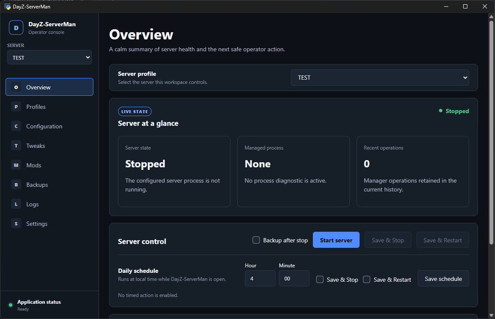
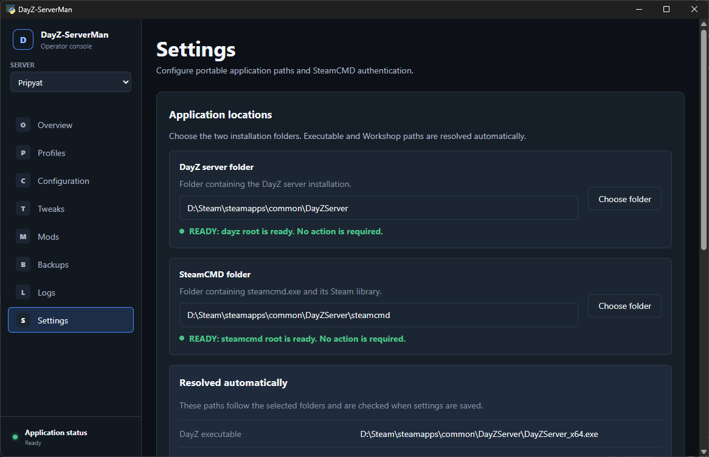
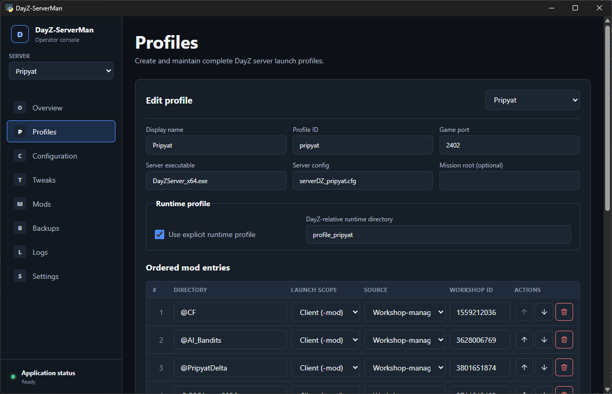
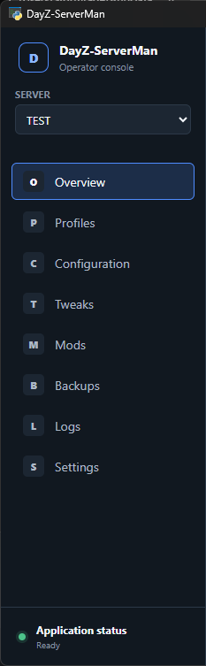
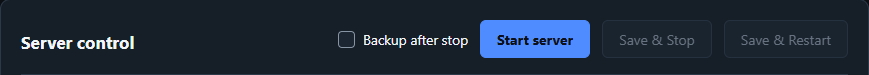
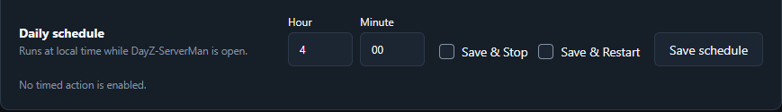
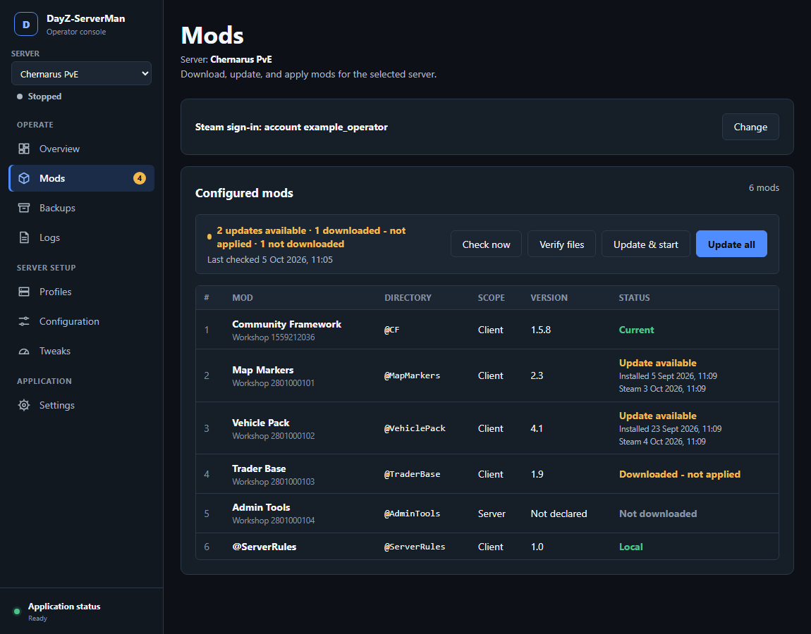
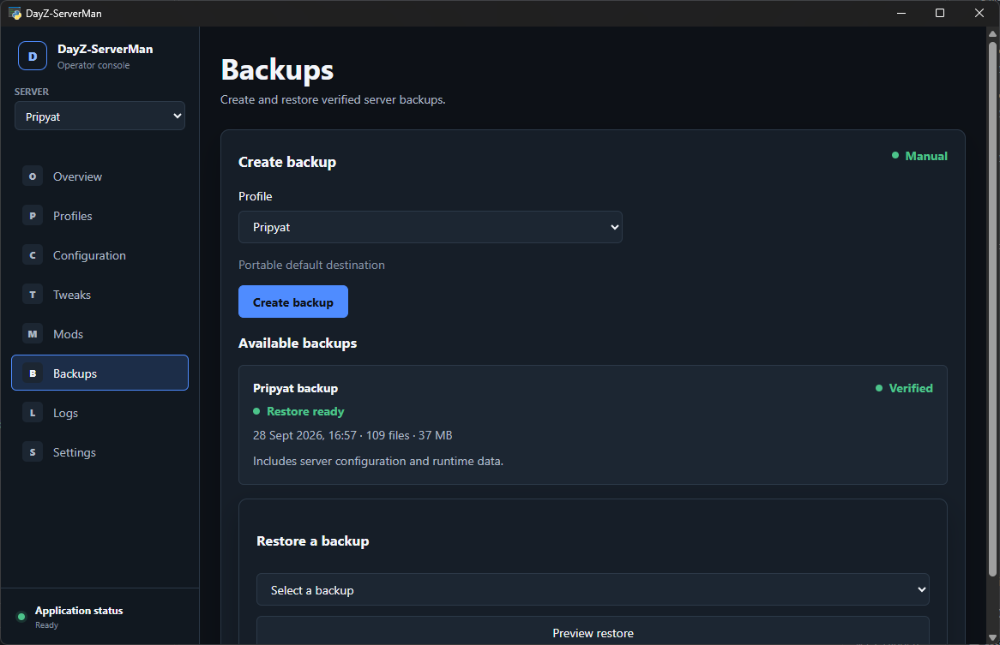

# DayZ-ServerMan operator guide

This directory is the complete movable application. Copy the whole directory.
Do not copy only the starter or `src` directory.

## Requirements

- Windows 11 x64
- Python 3.12 or 3.13 with `venv` and pip
- Microsoft Edge WebView2 Runtime
- Internet access for the first launch and dependency updates

## Start the application

Run:

```text
py DayZ-ServerMan.py
```

The first launch creates `.venv` beside the starter. It then installs the
pinned packages from `requirements.txt` and restarts with the local Python.
Later launches reuse this environment.

Do not copy `.venv` between computers. You can delete it if dependency setup
becomes damaged. The next launch creates it again.

<!-- shot:readme-01 -->


## First setup

1. Open **Settings**.
2. Select the folder that contains the DayZ server installation.
3. Select the folder that contains `steamcmd.exe` and its Steam library.
4. Keep the portable backup destination or select a custom folder.
5. Save the locations and review their status.
6. Create or import a server profile.

<!-- shot:readme-02 -->


The manager derives these paths from the selected folders:

- `DayZServer_x64.exe`
- `steamcmd.exe`
- `steamapps/workshop/content/221100`

The DayZ server, SteamCMD, backup folder, and manager can be in unrelated
locations.

## Create a server profile

Open **Profiles** and select **New profile**. Enter a display name, game port,
and mission. The profile ID is generated from the display name and can be
changed before creation.

The mission list comes from the configured DayZ installation's `mpmissions`
directory. Select **Custom mission…** to enter an installed custom mission such
as `mpmissions\Pripyat`. The directory must already exist inside the configured
DayZ installation. Profile creation does not download mission files or install
required mods.

DayZ-ServerMan creates these operational files inside the DayZ installation:

```text
serverman\<profile-id>\serverDZ.cfg
serverman\<profile-id>\profile\
```

Application source, Python packages, settings, and backups are not placed in
that directory. The generated configuration uses safe initial values and can
be adjusted from **Configuration** after creation.

Deleting a profile removes it from DayZ-ServerMan but keeps these operational
files. Creating the same profile ID again safely reuses a compatible
`serverDZ.cfg` and `profile` directory without overwriting either one.

When creation succeeds, the new profile is selected and remembered. Select
**Go to Overview**, then **Start server**. A “ready to start” result confirms
that the manager can resolve the executable, config, runtime directory,
mission, and configured mod paths. It cannot guarantee that a custom mission's
internal files or mod dependencies are correct.

<!-- shot:readme-03 -->


## Main workspaces

- **Overview** selects the active profile and controls the DayZ process. It
  shows **Starting** until the local Steam query endpoint answers, then shows
  **Ready**. A live process that does not answer after two minutes shows
  **Not responding** while safe stop and restart controls remain available.
- **Profiles** defines the launch command, runtime profile, and ordered mods.
- **Configuration** edits the selected server's core configuration.
- **Tweaks** edits gameplay, economy, weather, events, spawn, and population data.
- **Mods** downloads or updates Workshop items and applies changed content.
- **Backups** creates verified ZIP backups and provides reviewed restores.
<!-- shot:readme-04 -->


- **Logs** shows concise manager activity and captured DayZ server output.
  Routine interface polling is excluded. Select **Manager diagnostics** only when
  you need the underlying structured troubleshooting records.
- **Settings** configures external locations and SteamCMD sign-in settings.

The profile selector in the sidebar changes the active server without changing
the current page. DayZ-ServerMan remembers the selected profile.

## Stop, restart, and automatic backup

**Save & Stop** requests a normal Windows close and waits for the managed DayZ
process to exit. **Save & Restart** uses the same stop process before starting
the selected profile again.

Enable **Backup after stop** in the Overview server-control row to create a
verified backup after DayZ stops. The setting is stored separately for each
profile.

For restart, the order is stop, backup, then start. If backup creation fails,
the server remains stopped and the manager does not restart it.

The control requires a runtime profile directory in the selected profile.

<!-- shot:readme-05 -->


The second server-control row can schedule one daily **Save & Stop** or
**Save & Restart** action. Enter the hour and minute in local time. Select one
action, then select **Save schedule**. Clear both actions and save to disable
the schedule.

Schedules are stored separately for each profile. They run only while
DayZ-ServerMan is open. If the manager starts after today's scheduled time, it
waits until the next day. If the selected server is not running under this
manager at the scheduled time, the manager records a skipped run.

<!-- shot:readme-06 -->


## Mods and SteamCMD

The Mods page shows each configured Workshop item, its local version, and its
current state. **Download / update mods** asks SteamCMD to update the selected
profile's Workshop items.

<!-- shot:readme-07 -->


DayZ-ServerMan then verifies SteamCMD evidence and applies only content whose
recorded source state or destination state changed. Passwords and Steam Guard
codes belong only in the visible SteamCMD window.

## Backups and restores

The default destination is the `backups` directory beside this README. A
custom destination can be selected in Settings.

Backup names use the profile ID and local creation time:

```text
pripyat_2026-09-28_16-21-51.zip
```

<!-- shot:readme-08 -->


The manager verifies a backup before it lists the file as ready to restore.
Every new backup includes the server configuration, complete mission directory
(including `storage_<instanceId>` world and mod persistence), and runtime
profile. Restores require a review step before files are changed.

## Local application data

- `config/manager.json` stores configured external paths and Steam settings.
- `data/profiles/` stores server profiles.
- `data/ui-preferences.json` stores interface preferences.
- `data/schedules.json` stores daily stop and restart schedules.
- `data/logs/` stores manager and DayZ output.
- `data/operations/` stores operation records and recovery journals.
- `backups/` stores portable-default backup files.

Keep `config`, `data`, and `backups` when moving an existing configured copy.
A clean repository checkout contains only safe placeholders and
`config/manager.example.json`.

## Troubleshooting

- If setup fails, confirm that Python can run `-m venv` and `-m pip`.
- Confirm that PyPI is reachable during dependency installation.
- If the window cannot open, install or repair Microsoft Edge WebView2 Runtime.
- Review **Manager activity** on the Logs page when an operation fails. Use
  **Manager diagnostics** or `data/logs/manager.jsonl` only for technical detail.
- Do not delete `config`, `data`, or `backups` when preserving an installation.

## Before using a production server

Test Start, Save & Stop, Save & Restart, SteamCMD authentication, mod updates,
backup, and restore against a non-critical server copy. Keep the previous
manager and its data until this validation succeeds.

## License

DayZ-ServerMan uses the [MIT License](./LICENSE). Copy the `LICENSE` file with
this directory.

The license covers this project's source code only. DayZ server files, Steam
Workshop mods, and third-party assets keep their own terms.
